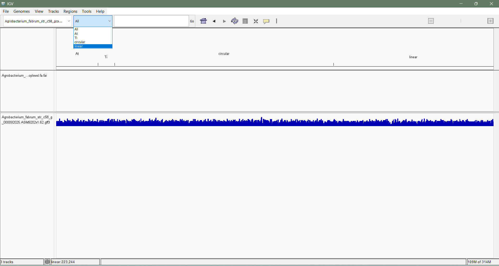
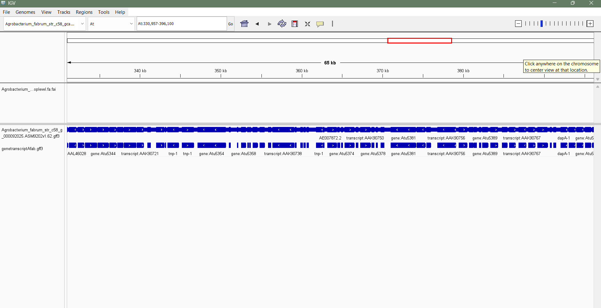
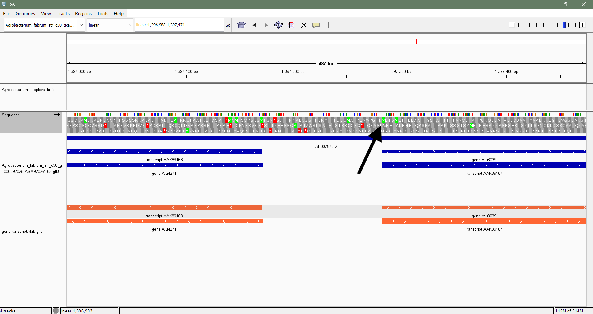
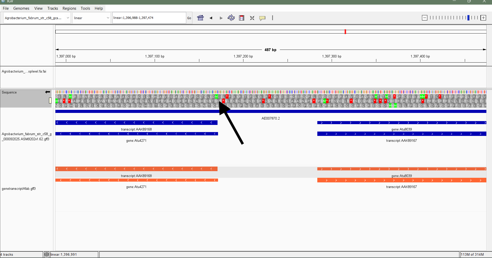
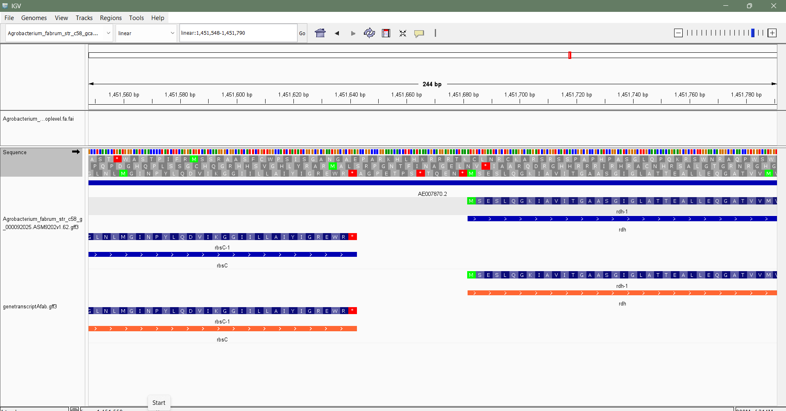
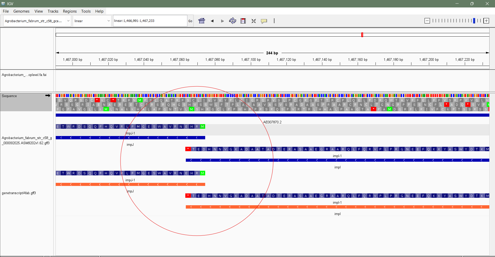

# Week 03: Genome visualization using IGV and annotations related to genome
### I chose agrobacterium_fabrum_str_c58_gca_000092025

## 1. Get the fasta file 
### Input 
```
wget https://ftp.ensemblgenomes.ebi.ac.uk/pub/bacteria/current/fasta/bacteria_0_collection/agrobacterium_fabrum_str_c58_gca_000092025/dna/Agrobacterium_fabrum_str_c58_gca_000092025.ASM9202v1.dna.toplevel.fa.gz
gunzip Agrobacterium_fabrum_str_c58_gca_000092025.ASM9202v1.dna.toplevel.fa.gz 
mv Agrobacterium_fabrum_str_c58_gca_000092025.ASM9202v1.dna.toplevel.fa Afab.fa
cat Afab.fa | grep ">"
```
### Output
```
>At dna:plasmid plasmid:ASM9202v1:At:1:542868:1 REF
>Ti dna:plasmid plasmid:ASM9202v1:Ti:1:214233:1 REF
>circular dna:chromosome chromosome:ASM9202v1:circular:1:2841580:1 REF
>linear dna:chromosome chromosome:ASM9202v1:linear:1:2075577:1 REF
```
This can be visualized in IGV as :


## 2. Check genome size and features
### Input 
```
wget https://ftp.ensemblgenomes.ebi.ac.uk/pub/bacteria/current/gff3/bacteria_0_collection/agrobacterium_fabrum_str_c58_gca_000092025/Agrobacterium_fabrum_str_c58_gca_000092025.ASM9202v1.62.gff3.gz
gunzip Agrobacterium_fabrum_str_c58_gca_000092025.ASM9202v1.62.gff3.gz 
cat Afab.gff3 | cut -f 1 | sort | uniq
```
### Output
```
At
circular
#!genebuild-last-updated 2014-05
#!genome-build-accession GCA_000092025.1
#!genome-build Cereon ASM9202v1
#!genome-version ASM9202v1
##gff-version 3
linear
##sequence-region   At 1 542868
##sequence-region   circular 1 2841580
##sequence-region   linear 1 2075577
##sequence-region   Ti 1 214233
Ti

```
## 3. Perform Gene | Transcript separation
### input
```
grep -i -E "gene|transcript" Afab.gff3 > genetranscriptAfab.gff3
cat genetranscriptAfab.gff3 | head -5
```
### output 
```
#!genebuild-last-updated 2014-05
At      ena     gene    70      1377    .       +       .       ID=gene:Atu5000;Name=repA;biotype=protein_coding;description=replication protein A;gene_id=Atu5000;logic_name=ena
At      ena     mRNA    70      1377    .       +       .       ID=transcript:AAK90380;Parent=gene:Atu5000;Name=repA-1;biotype=protein_coding;tag=Ensembl_canonical;transcript_id=AAK90380
At      ena     exon    70      1377    .       +       .       Parent=transcript:AAK90380;Name=AAK90380-1;constitutive=1;ensembl_end_phase=0;ensembl_phase=0;exon_id=AAK90380-1;rank=1
At      ena     CDS     70      1377    .       +       0       ID=CDS:AAK90380;Parent=transcript:AAK90380;protein_id=AAK90380
```
## 4. Visualize the simplified GFF in IGV as a separate track. Compare the visualization of the original GFF with the simplified GFF.
The original gff3 file showed full detailed gene features like gene, mRNA, exon, pseudogene but in the simplified GFF we can see only the transcripts no exon, CDS, UTRs. We see a box spanning from transcript start to transcript end, without intron–exon breakdown.


## 5. Zoom in to see the sequences, expand the view to show the translation table in IGV. Note how the translation table needs to be displayed in the correct orientation for it to make sense.
In the two images below I have zoomed in to see the sequence and we can see two genes transcribing in the opposite directions therefore I took two images one in forward direction (Image 3) and one in reverse direction (Image 4)
We can observe 
In the forward direction


In the reverse direction


## 6. Visually verify that the first coding sequence of a gene starts with a start codon and that the last coding sequence of a gene ends with a stop codon.
In this image we can see two genes one ending with the stop codon and the next one beginning with a start codon coding for methionine



In this image we can observe an overlapping of genes in the prokaryote genome both are minus strand. both impJ and impJ-1 may be part of the same operon, but they encode different proteins despite overlapping sequence.


