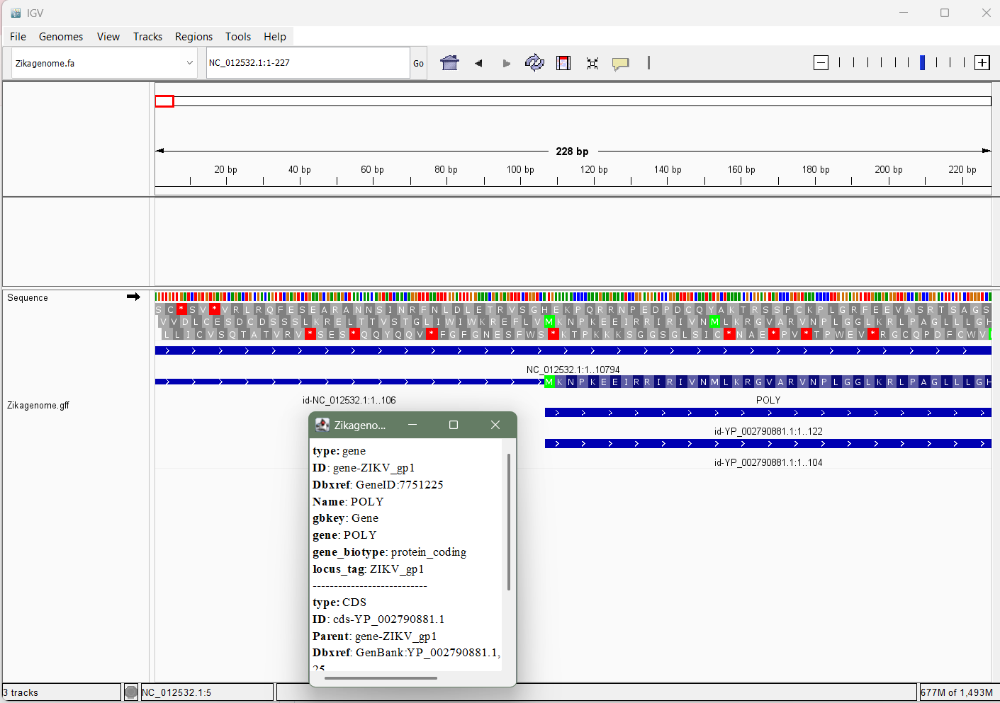
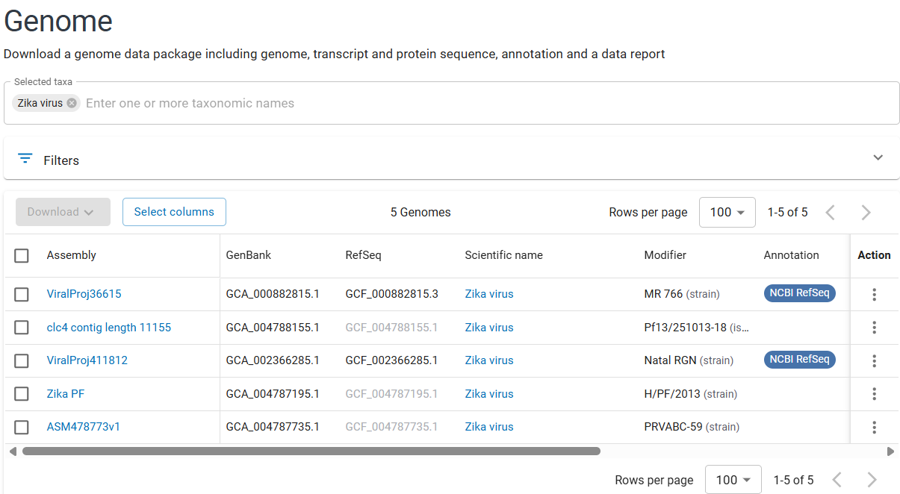

# Paper : Zika Virus Targets Human Cortical Neural Precursors and Attenuates Their Growth published in the journal Cell Stem Cell in 2016.

## The accession numbers for the genome-
BioProject: PRJNA313294
GEO series: GSE78711
strain of the ZIKV, MR766
NCBI RefSeq- GCF_000882815.3., GCA_000882815.1

## Genome Summary
```
datasets summary genome accession GCA_000882815.1 | jq
```
```
datasets summary genome accession GCA_000882815.1

{
  "reports": [
    {
      "accession": "GCA_000882815.1",
      "assembly_info": {
        "assembly_level": "Complete Genome",
        "assembly_name": "ViralProj36615",
        "assembly_status": "current",
        "assembly_type": "haploid",
        "paired_assembly": {
          "accession": "GCF_000882815.3",
          "annotation_name": "Annotation submitted by NCBI RefSeq",
          "status": "current"
        },
        "release_date": "2009-04-06",
        "submitter": "Division of Vector-Borne Infect. Dis., CDC"
      },
      "assembly_stats": {
        "atgc_count": "10794",
        "contig_l50": 1,
        "contig_n50": 10794,
        "gc_count": "5498",
        "gc_percent": 51,
        "number_of_component_sequences": 1,
        "number_of_contigs": 1,
        "number_of_scaffolds": 1,
        "scaffold_l50": 1,
        "scaffold_n50": 10794,
        "total_number_of_chromosomes": 1,
        "total_sequence_length": "10794",
        "total_ungapped_length": "10794"
      },
      "current_accession": "GCA_000882815.1",
      "organism": {
        "infraspecific_names": {
          "strain": "MR 766"
        },
        "organism_name": "Zika virus",
        "tax_id": 64320
      },
      "paired_accession": "GCF_000882815.3",
      "source_database": "SOURCE_DATABASE_GENBANK",
      "type_material": {
        "type_display_text": "ICTV species exemplar",
        "type_label": "TYPE_ICTV"
      }
    }
  ],
  "total_count": 1
```

## The commands to download the data.
```
datasets download genome accession GCF_000882815.3 --include genome,gff3,gtf
datasets download genome accession GCF_000882815.3 --include gff3,rna,cds,protein,genome,seq-report
unzip -n ncbi_dataset.zip
mv ncbi_dataset/data/GCF_000882815.3/GCF_000882815.3_ViralProj36615_genomic.fna Zikagenome.fa
mv ncbi_dataset/data/GCF_000882815.3/genomic.gff  Zikagenome.gff
```

## Genome Visualization using IGV


## Zika Genome Features
### Input
```
#Size of the genome
grep -v ">" Zikagenome.fa | tr -d '\n' | wc -c
# To know about the 
cat Zikagenome.gff | cut -f 1 | sort | uniq
#To see what are the features and then rank it
cat Zikagenome.gff | grep -v '#' | cut -f 3 | sort-uniq-count-rank
#To see what is the single gene it codes for 
grep -v '#' Zikagenome.gff | awk '$3=="gene" {print $9}' 
```
### Output 
```
10794

###
#!genome-build-accession NCBI_Assembly:GCF_000882815.3
#!genome-build ViralProj36615
#!gffID=gene-ZIKV_gp1;Dbxref=GeneID:7751225;Name=POLY;gbkey=Gene;gene=POLY;gene_biotype=protein_coding;locus_tag=ZIKV_gp1-spec-version 1.21
##gff-version 3
NC_012532.1
#!processor NCBI annotwriter
##sequence-region NC_012532.1 1 10794
##species https://www.ncbi.nlm.nih.gov/Taxonomy/Browser/wwwtax.cgi?id=64320

14      mature_protein_region_of_CDS
1       CDS
1       five_prime_UTR
1       gene
1       region
1       three_prime_UTR

ID=gene-ZIKV_gp1;Dbxref=GeneID:7751225;Name=POLY;gbkey=Gene;gene=POLY;gene_biotype=protein_coding;locus_tag=ZIKV_gp1
```
## Other Accessions 
### Input
```
datasets summary genome taxon "Zika virus" \
>   | grep -oE 'GC[FA]_[0-9]+\.[0-9]' \
>   | sort -u


```

### Output
```
GCA_000882815.1
GCA_002366285.1
GCA_004787195.1
GCA_004787735.1
GCA_004788155.1
GCF_000882815.3
GCF_002366285.1
GCF_004787195.1
GCF_004787735.1
GCF_004788155.1
```
## I checked the details of other accessions of Zika virus 


## other questions which could be answered if I used a different genome build

