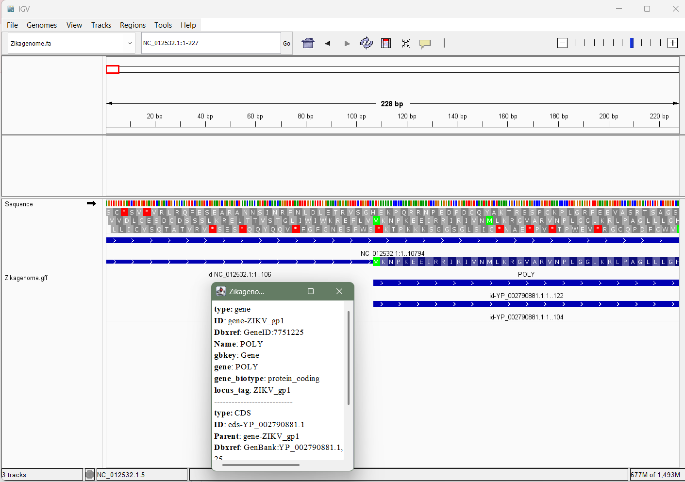
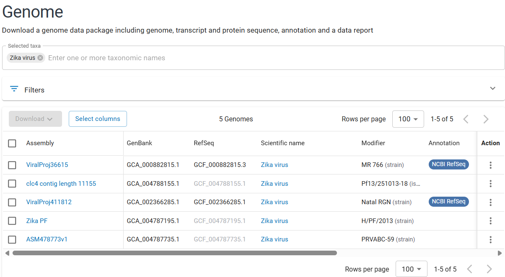

# Paper - Zika Virus Targets Human Cortical Neural Precursors and Attenuates Their Growth published in the journal Cell Stem Cell in 2016.

## Accession of Zika Genome 
BioProject: PRJNA313294
GEO series: GSE78711
MR766 strain - 
GCA_000882815.1	
GCF_000882815.3

## Genome Summary 
### Input 
```
datasets summary genome accession GCA_000882815.1 | jq
```
### Output
```
{
  "reports": [
    {
      "accession": "GCA_000882815.1",
      "assembly_info": {
        "assembly_level": "Complete Genome",
        "assembly_name": "ViralProj36615",
        "assembly_status": "current",
        "assembly_type": "haploid",
        "paired_assembly": {
          "accession": "GCF_000882815.3",
          "annotation_name": "Annotation submitted by NCBI RefSeq",
          "status": "current"
        },
        "release_date": "2009-04-06",
        "submitter": "Division of Vector-Borne Infect. Dis., CDC"
      },
      "assembly_stats": {
        "atgc_count": "10794",
        "contig_l50": 1,
        "contig_n50": 10794,
        "gc_count": "5498",
        "gc_percent": 51,
        "number_of_component_sequences": 1,
        "number_of_contigs": 1,
        "number_of_scaffolds": 1,
        "scaffold_l50": 1,
        "scaffold_n50": 10794,
        "total_number_of_chromosomes": 1,
        "total_sequence_length": "10794",
        "total_ungapped_length": "10794"
      },
      "current_accession": "GCA_000882815.1",
      "organism": {
        "infraspecific_names": {
          "strain": "MR 766"
        },
        "organism_name": "Zika virus",
        "tax_id": 64320
      },
      "paired_accession": "GCF_000882815.3",
      "source_database": "SOURCE_DATABASE_GENBANK",
      "type_material": {
        "type_display_text": "ICTV species exemplar",
        "type_label": "TYPE_ICTV"
      }
    }
  ],
  "total_count": 1
}
```

## Command to download Genome data 
### Input
```
datasets download genome accession GCF_000882815.3 --include genome,gff3,gtf
mv ncbi_dataset/data/GCF_000882815.3/GCF_000882815.3_ViralProj36615_genomic.fna Zikagenome.fa
mv ncbi_dataset/data/GCF_000882815.3/ Zikagenome.gff
```

## Genome Visualization
The figure is showing a single gene present in the virus genome. Methionine is marked in green indicating first amino acid of the protein (capsid protein).


## Genome Features
```
#How Big is the Genome
grep -v ">" Zikagenome.fa | tr -d '\n' | wc -c

#Genomic details
cat Zikagenome.gff | cut -f 1 | sort | uniq

#What are the features
cat Zikagenome.gff | grep -v '#' | cut -f 3 | sort-uniq-count-rank

#What is the gene being coded
grep -v '#' Zikagenome.gff | awk '$3=="gene" {print $9}'

#What other accessions are there 
datasets summary genome taxon "Zika virus" \
>   | grep -oE 'GC[FA]_[0-9]+\.[0-9]' \
>   | sort -u
```
### Output 
```
10794

###
#!genome-build-accession NCBI_Assembly:GCF_000882815.3
#!genome-build ViralProj36615
#!gff-spec-version 1.21
##gff-version 3
**NC_012532.1**
#!processor NCBI annotwriter
##sequence-region NC_012532.1 1 10794
##species https://www.ncbi.nlm.nih.gov/Taxonomy/Browser/wwwtax.cgi?id=64320

14      mature_protein_region_of_CDS
1       CDS
1       five_prime_UTR
1       gene
1       region
1       three_prime_UTR

ID=gene-ZIKV_gp1;Dbxref=GeneID:7751225;Name=POLY;gbkey=Gene;gene=POLY;gene_biotype=protein_coding;locus_tag=ZIKV_gp1


GCA_000882815.1
GCA_002366285.1
GCA_004787195.1
GCA_004787735.1
GCA_004788155.1
GCF_000882815.3
GCF_002366285.1
GCF_004787195.1
GCF_004787735.1
GCF_004788155.1
```

## To check what are the other accessions which could have been used 
All the other accessions represent different strains of Zika virus. 


## Questions which could have been asked if other accessions were used
Q1. Using other accession/ strain of a virus, we can ask which mutations distinguish the lineages, and if they are under any positive selection.
Q2. What are the differences in amino acids which makes the MR766 strain unique 
Q3. comparing two strains to ask if a mutation in the E (envelope) protein alter the viral entry into human neural progenitor cells (hNPCs)
Q4. How far has the genome diverged between African (MR766), Asian, and American lineages?
Q5. 
