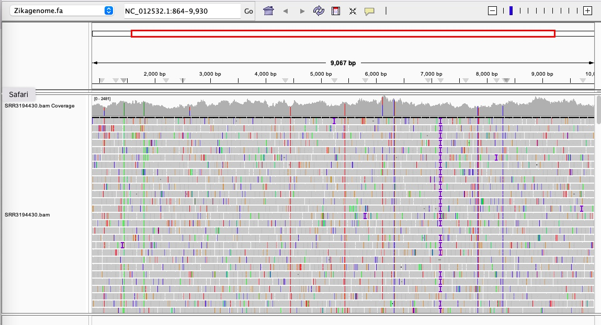

# This week’s goal was to automate the workflow for mapping sequence reads to the Zika virus genome using a Makefile, and to visualize the resulting alignments in IGV

## First:  Making a makefile 
### The Makefile performs the following steps automatically:
Download the reference Zika genome (MR766 strain).
Index the genome for alignment.
Download raw reads from the NCBI SRA database.
Subsample reads to achieve ~10× genome coverage.
Align the reads to the genome using bwa mem.
Compute mapping statistics and coverage using samtools.
Visualize the aligned reads in IGV.

### Things to do before calling makefile 
```
micromamba activate bioinfo
```
Prepare the makefile 
The makefile is attached below
```

SHELL = bash
.ONESHELL:
.SHELLFLAGS = -eu -o pipefail -c
.DELETE_ON_ERROR:
MAKEFLAGS += --warn-undefined-variables
MAKEFLAGS += --no-builtin-rules


# Zika Virus Genome Pipeline
# Purpose: Automate genome download, indexing, alignment, feature analysis, and ~10x read subsampling
# Usage: make all

# ---- VARIABLES ----
ACC_GCF = GCF_000882815.3
ACC_GCA = GCA_000882815.1
TAXON = "Zika virus"
SRR_ID = SRR3194430
NREADS = 1500
OUTDIR = ncbi_dataset
READDIR = reads
GENOME_FA = Zikagenome.fa
GFF = Zikagenome.gff
INDEX_PREFIX = Zikagenome
ALIGN_PREFIX = alignments

# ---- RULES ----
all: genome features accessions reads subsample index align
	@echo "All pipeline steps completed successfully."

# ---- 1. Download genome and annotation ----
$(GENOME_FA) $(GFF):
	@echo ">> Downloading genome and annotation..."
	datasets summary genome accession $(ACC_GCA) | jq
	datasets download genome accession $(ACC_GCF) --include genome,gff3,gtf
	unzip -o ncbi_dataset.zip -d $(OUTDIR) -x README.md
	mv $(OUTDIR)/ncbi_dataset/data/$(ACC_GCF)/*.fna $(GENOME_FA)
	mv $(OUTDIR)/ncbi_dataset/data/$(ACC_GCF)/*.gff $(GFF)
	@echo " Genome and annotation downloaded and renamed."

genome: $(GENOME_FA) $(GFF)
	@echo ">> Computing genome size..."
	@GENOME_SIZE=$$(grep -v ">" $(GENOME_FA) | tr -d '\n' | wc -c); \
	echo "Genome size (bp): $$GENOME_SIZE"

# ---- 2. Count features in GFF ----
features: $(GFF)
	@echo ">> Counting genomic features..."
	@echo "Genomic details:"
	@cut -f1 $(GFF) | sort | uniq
	@echo ""
	@echo "Genome features are:"
	@grep -v '#' $(GFF) | cut -f3 | sort | uniq -c | sort -nr
	@echo ""
	@echo "The genes being coded are:"
	@awk '$$3=="gene" {print $$9}' $(GFF)
	@echo " Feature summary complete."

# ---- 3. List other accessions ----
accessions:
	@echo ">> Listing other genome accessions for $(TAXON)..."
	@datasets summary genome taxon $(TAXON) | grep -oE 'GC[FA]_[0-9]+\.[0-9]' | sort -u | head -10
	@echo " Accessions listed."

# ---- 4. Download sequencing reads ----
$(READDIR)/$(SRR_ID).fastq:
	@echo ">> Prefetching $(SRR_ID)..."
	prefetch $(SRR_ID)
	mkdir -p $(READDIR)
	fasterq-dump $(SRR_ID) -O $(READDIR)/
	@echo " Reads downloaded."

reads: $(READDIR)/$(SRR_ID).fastq
	@seqkit stats $(READDIR)/$(SRR_ID).fastq

# ---- 5. Subsample reads (~10x coverage) ----
reads/$(SRR_ID)_subsample.fastq: reads
	@echo ">> Subsampling $(NREADS) reads (~10x coverage)..."
	seqkit sample -n $(NREADS) $(READDIR)/$(SRR_ID).fastq > $(READDIR)/$(SRR_ID)_subsample.fastq
	seqkit stats $(READDIR)/$(SRR_ID)_subsample.fastq
	@echo " Subsampling complete."

subsample: reads/$(SRR_ID)_subsample.fastq

# ---- 6. Index genome ----
index: $(GENOME_FA)
	@echo ">> Indexing genome with BWA..."
	bwa index -p $(INDEX_PREFIX) $(GENOME_FA)
	@echo " Genome indexing complete."

# ---- 7. Align reads to genome ----
align: index reads/$(SRR_ID)_subsample.fastq
	@echo ">> Aligning reads to genome..."
	mkdir -p $(ALIGN_PREFIX)
	bwa mem $(INDEX_PREFIX) $(READDIR)/$(SRR_ID)_subsample.fastq > $(ALIGN_PREFIX)/$(SRR_ID).sam
	@echo ">> Converting SAM to sorted BAM..."
	samtools view -bS $(ALIGN_PREFIX)/$(SRR_ID).sam | samtools sort -o $(ALIGN_PREFIX)/$(SRR_ID).bam
	samtools index $(ALIGN_PREFIX)/$(SRR_ID).bam
	rm $(ALIGN_PREFIX)/$(SRR_ID).sam
	@echo " Alignment complete: $(ALIGN_PREFIX)/$(SRR_ID).bam"


.PHONY: all genome features accessions reads subsample index align clean

```
### Run the makefile
```
make all
```

## Alignment Statistics 
```
samtools flagstat SRR3194430.bam 
```

76300000 + 0 in total (QC-passed reads + QC-failed reads)
76299868 + 0 primary
0 + 0 secondary
132 + 0 supplementary
0 + 0 duplicates
0 + 0 primary duplicates
202364 + 0 mapped (0.27% : N/A)
202232 + 0 primary mapped (0.27% : N/A)
0 + 0 paired in sequencing
0 + 0 read1
0 + 0 read2
0 + 0 properly paired (N/A : N/A)
0 + 0 with itself and mate mapped
0 + 0 singletons (N/A : N/A)
0 + 0 with mate mapped to a different chr
0 + 0 with mate mapped to a different chr (mapQ>=5)

### What percentage of reads aligned to the genome?
0.27% which is extremely less 
###What was the expected average coverage?
N = number of reads (expected 1500 subsampled reads, or 76,300,000 full reads)
L = average read length (~75 bp for SRR3194430)
G = genome length (~10,794 bp for Zika MR766)

### What is the observed average coverage?
X+ observed expected​=0.0027×530,000≈1,431× . So the expected average coverage for the mapped fraction is about 1,400×.
How much does the coverage vary across the genome? (Provide a visual estimate
```
samtools depth SRR3194430.bam | awk '{sum+=$3} END { print "Average coverage:", sum/NR }'
```
Average coverage: 1409.39

## Visualizing Bam file in IGV 



