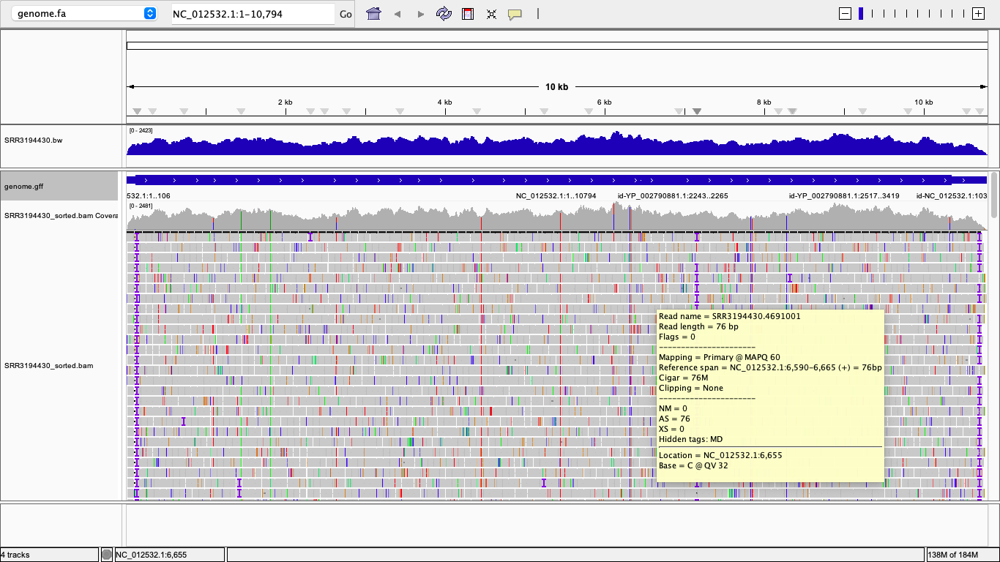
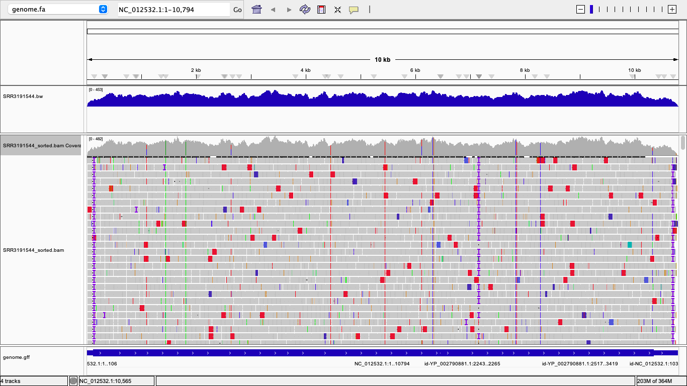
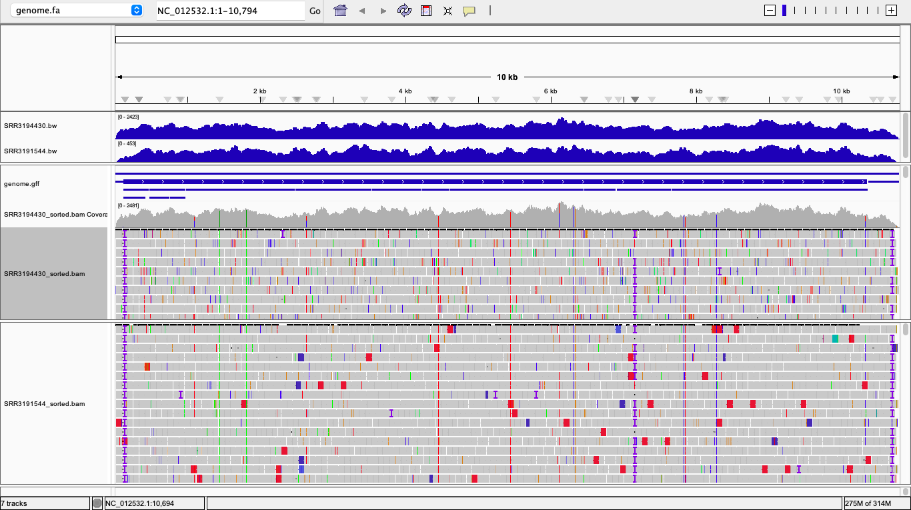

## Week 7 Assignment - Reusable Makefile, using bigwig and bam file visualization

A makefile is given in this repository. The aims of the makefile are:
1. Downloads the genome 
2. Downloads fastq reads by taking SRR number in parameters
3. Indexes the reference genome
4. Aligns the single and paired end reads to the reference genome
5. Converts the bam files generated to bigwig for IGV visualization

## Makefile options: 

### get_genome 
Use the get_genome target to download both the FASTA (genome sequence) and GFF (annotation) files for a specific NCBI accession.
```
make get_genome genome=GCF_000882815.3
```
These files will be unzipped and renamed for convenient use in later steps.

### 2. get_fastq and get_pairedfastq
Download single end fastq for Illumina NestSeq dataset and Paired-end fastq data for Illumina MiSeq dataset.
```
make get_fastq fastq=SRR3194430
make get_pairedfastq fastq=SRR3191544
```
### 3. index
```
make index genome_fa=ref/genome.fa
```
### 4. align
```
make align fastq=SRR3194430
make align fastq=SRR3191544
```
### 5. bigwig
```
make bigwigse fastq=SRR3194430 genome_fa=ref/genome.fa
make bigwigpe fastq=SRR3191544 genome_fa=ref/genome.fa
```
### all : get_genome	get_fastq get_pairedfastq index alignsingle alignpaired bigwigse bigwigpe
```
make all 
```
## IGV visualization of bam files 

### First : Illumina NextSeq for single end dataset 


### Second : Illumina MiSeq for paired end dataset



## Briefly describe the differences between the alignment in both files.

## Briefly compare the statistics for the two BAM files.
For Illumina NextSeq dataset 
```
samtools flagstat SRR3194430_sorted.bam
```
Output :
```
76300000 + 0 in total (QC-passed reads + QC-failed reads)
76299868 + 0 primary
0 + 0 secondary
132 + 0 supplementary
0 + 0 duplicates
0 + 0 primary duplicates
202364 + 0 mapped (0.27% : N/A)
202232 + 0 primary mapped (0.27% : N/A)
0 + 0 paired in sequencing
0 + 0 read1
0 + 0 read2
0 + 0 properly paired (N/A : N/A)
0 + 0 with itself and mate mapped
0 + 0 singletons (N/A : N/A)
0 + 0 with mate mapped to a different chr
0 + 0 with mate mapped to a different chr (mapQ>=5)
```
For Illumina MiSeq dataset 
```
samtools flagstat SRR3191544_sorted.bam
```
Output: 
```
14723148 + 0 in total (QC-passed reads + QC-failed reads)
14723054 + 0 primary
0 + 0 secondary
94 + 0 supplementary
0 + 0 duplicates
0 + 0 primary duplicates
42885 + 0 mapped (0.29% : N/A)
42791 + 0 primary mapped (0.29% : N/A)
14723054 + 0 paired in sequencing
7361527 + 0 read1
7361527 + 0 read2
42170 + 0 properly paired (0.29% : N/A)
42526 + 0 with itself and mate mapped
265 + 0 singletons (0.00% : N/A)
0 + 0 with mate mapped to a different chr
0 + 0 with mate mapped to a different chr (mapQ>=5)
```
## How many primary alignments dows each of your BAM files contain?

For the Illumina NextSeq dataset (SRR3194430), the samtools flagstat output reports a total of 76,300,000 reads, of which 76,299,868 were classified as primary alignments. This indicates that nearly all sequencing records were recognized as primary entries in the BAM file, meaning they represent the main alignment record for each read, regardless of whether the read successfully mapped to the reference genome.
For the Illumina MiSeq dataset (SRR3191544), the total number of reads reported is 14,723,148, and 14,723,054 of these were primary alignments. Similar to the NextSeq dataset, this shows that almost every sequencing read has a corresponding primary alignment entry.

## What coordinate has the largest observed coverage?

```
samtools depth alignments/SRR3194430_sorted.bam | sort -k3,3nr | head -n 1
samtools depth alignments/SRR3191544_sorted.bam | sort -k3,3nr | head -n 1
```

Output: 
```
samtools depth SRR3194430_sorted.bam | sort -k3,3nr | head -n 1
NC_012532.1	6143	2481

samtools depth alignments/SRR3191544_sorted.bam | sort -k3,3nr | head -n 1

NC_012532.1	3442	482
```
The position with the highest observed coverage was coordinate 6143 on the reference sequence NC_012532.1, with a maximum coverage depth of 2481×.

The position with the highest coverage was coordinate 3442 on NC_012532.1, with a maximum depth of 482×.
## Select a gene of interest. How many alignments on a forward strand cover the gene?

First check what are the genes present 
```
grep -w "gene" ref/genome.gff | awk -F'\t' '{print $9}' | sed 's/;/\n/g' | grep -E '^gene=' | sed 's/gene=//' | sort -u

Output : POLY
```
Check Co-ordinates 
```
$ awk -F'\t' '$3=="CDS" { > split($9, a, ";"); > gene=""; product=""; > for (i in a) { > if (a[i] ~ /^gene=/) { gene = a[i]; sub("gene=", "", gene); } > if (a[i] ~ /^product=/) { product = a[i]; sub("product=", "", product); } > } > printf("%-12s %-30s %s:%s-%s\n", gene, product, $1, $4, $5); > }' ref/genome.gff | sort -u

Output: POLY polyprotein NC_012532.1:107-10366
```
The entire genome (from position 107 to 10366) is annotated as one continuous ORF called POLY.

To check alignments - 
1. For Next Seq
2. For MiSeq -
```
samtools view -c -F 3348 -q 10 alignments/SRR3194430_sorted.bam "NC_012532.1:107-10366"
Output : 99,160 alignments
samtools view -c -f 64 -F 3348 -q 10 alignments/SRR3191544_sorted.bam "NC_012532.1:107-10366"
Output: 10,464 fragments
```
-F 3348 excludes unmapped, reverse-strand, secondary, supplementary, and duplicate records.
-f 64 (MiSeq) counts each paired fragment once by selecting read1 only.
-q 10 keeps MAPQ ≥ 10.

