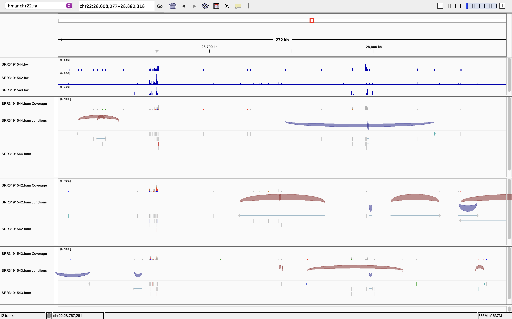
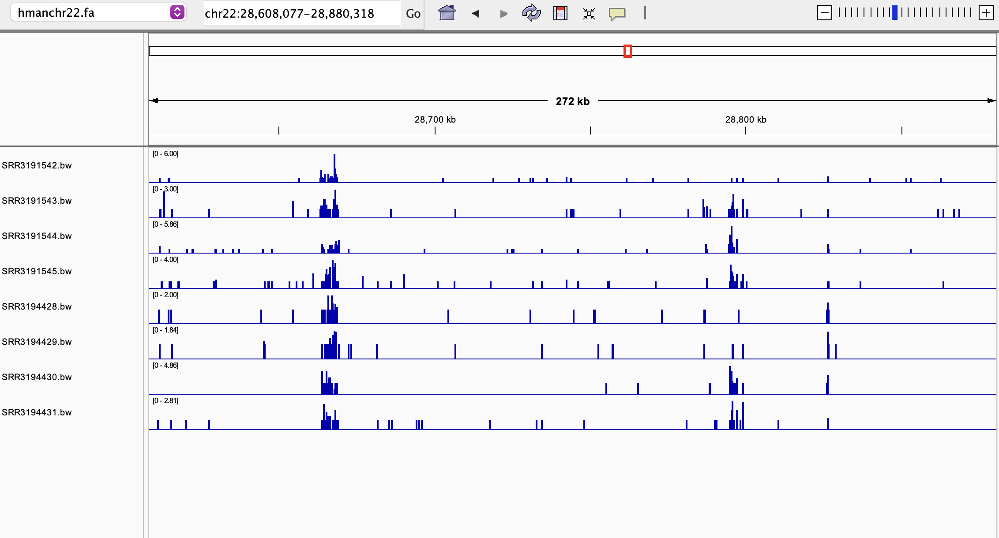

## Week09 RNA-Seq Analysis Pipeline
For this week's assignment, the previous makefile (provided in the repository) was improved and automation process was also rewritten. 

## Prerequisites

```bash
mamba activate bioinfo
```

## Pipeline Overview

This pipeline automates the processing of RNA-seq data using a Makefile and design.csv file. The pipeline handles both single-end and paired-end reads, producing aligned BAM files and visualization files.

## Running the Pipeline

Initialize Reference Genome
Download and index the reference genome (only needed once):

```bash
make get_genome ref=ref/hg38 genome=chr22 species=human
make genome_index genome_fa=ref/hmanchr22.fa
```
## For processing single sample (single or paired-end), run:

```bash
make get_fastq srr=<SRR_ID> reads=reads fastqcreports=reads/fastqc_reports
make alignreads genome_fa=ref/hmanchr22 reads=reads srr=SRR3191544 bam=bam
make bigwig srr=SRR3191544 bam=bam genome_fa=ref/hmanchr22
```
## Parallel processing of multiple samples 
To process all samples in parallel from design.csv, make sure GNU Parallel can create temporary files. On macOS the default temp dir sometimes isn't writable from conda environments — create a per-user tmpdir and pass it with `--tmpdir`.

Generate the design file
```
make design
```
 
```
# Create a safe tmpdir (do this once per session)
mkdir -p ~/parallel_tmp
chmod 700 ~/parallel_tmp

# Download FASTQ files for all human samples
awk -F',' 'NR>1 {print $1}' design.csv \
  | parallel --tmpdir ~/parallel_tmp --jobs 2 --bar \
      'make get_fastq srr={} reads=reads fastqcreports=reads/fastqc_reports'

# Align all samples to human chr22 (hg38 build)
awk -F',' 'NR>1 {print $1}' design.csv \
  | parallel --tmpdir ~/parallel_tmp --jobs 2 --bar \
      'make alignreads srr={} genome_fa=ref/hmanchr22 reads=reads bam=bam'

# Generate BigWig files for visualization
awk -F',' 'NR>1 {print $1}' design.csv \
  | parallel --tmpdir ~/parallel_tmp --jobs 2 --bar \
      'make bigwig srr={} bam=bam genome_fa=ref/hmanchr22.fa'
```

## Output Files

For each processed sample, the pipeline generates:

- **FASTQ files**: 
  - Single-end: `reads/<SRR>.fastq.gz`
  - Paired-end: `reads/<SRR>_1.fastq.gz`, `reads/<SRR>_2.fastq.gz`
- **FastQC reports**: `reads/fastqc_reports/*_fastqc.html`
- **Alignment files**: 
  - BAM: `bam/<SRR>.bam`
  - Index: `bam/<SRR>.bam.bai`
  - Stats: `bam/<SRR>_align_stats.txt`
- **Visualization files**: `bam/<SRR>.bw` (BigWig for IGV)

---

### Screenshot from IGV visualizing three SRR bam files and their bw files




**Note:**
- The Makefile automatically handles both single-end and paired-end data.
- Adjust the number of jobs in GNU Parallel as needed for your system.
- All output directories are created automatically if they do not exist.
