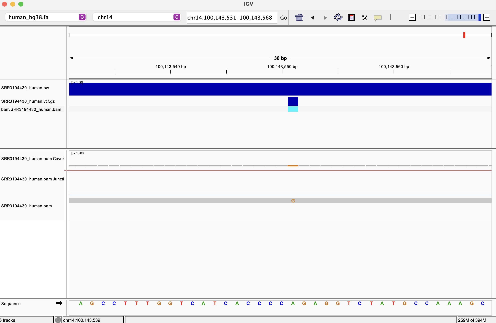
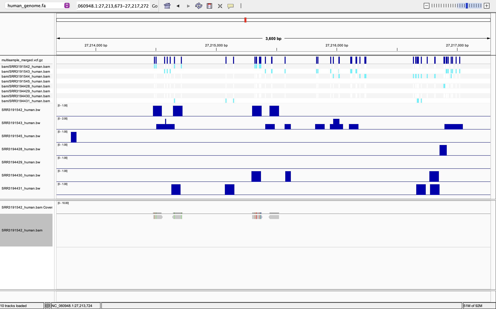
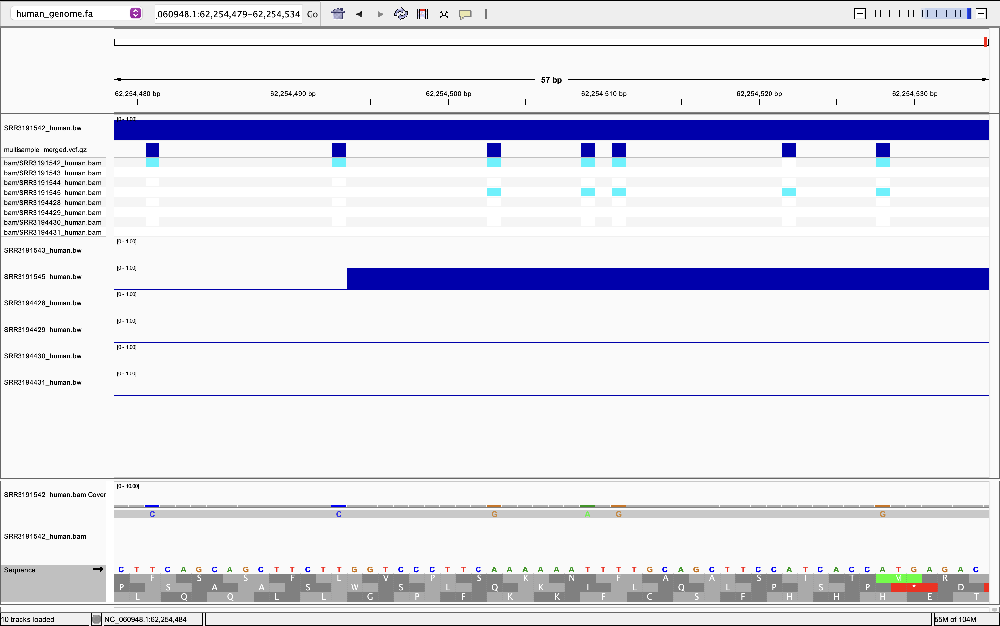

## Prerequisites

```bash
mamba activate bioinfo
```

## Pipeline Overview

This pipeline automates the processing of RNA-seq data using a Makefile and design.csv file. The pipeline handles both single-end and paired-end reads, producing aligned BAM files and visualization files.

## Running the Pipeline

### 1. Prepare design file 
```bash
make design PRJNA=PRJNA313294
```
### 2. Download and index the reference genome 
Download and index the reference genome (only needed once per species):
```bash
# Human chromosome 22
make get_genome species=human  GCF=GCF_000882815.3 REF=ref ACC=NC_060948.1
# Zika virus reference
make get_genome species=zika GCF=GCF_000882815.3 REF=ref ACC=NC_012532.1
```
```bash
# Build genome index
make genome_index species=human REF=ref/human_genome.fa
make genome_index species=zika  REF=ref/zika_genome.fa
```


## For processing single sample (single or paired-end), run:

```bash
# Download a subset of reads (first 100,000 for test)
make get_fastq srr=SRR3191545 READS=reads fastqcreports=reads/fastqc_reports


# Align reads
make alignreads species=human REF=ref/human_genome.fa READS=reads srr=SRR3191545 bam=bam
make alignreads species=zika  REF=ref/zika_genome.fa  READS=reads srr=SRR3191545 bam=bam

# Generate BigWig for IGV visualization
make bigwig species=human srr=SRR3191545 bam=bam REF=ref/human_genome.fa
make bigwig species=zika  srr=SRR3191545 bam=bam REF=ref/zika_genome.fa

# Call variants using bcftools
make call_variants species=human REF=ref/human_genome.fa bam=bam srr=SRR3191545 vcf=vcf
make call_variants species=zika  REF=ref/zika_genome.fa bam=bam srr=SRR3191545 vcf=vcf
```

## Parallel processing of multiple samples 
To process all samples in parallel from design.csv, make sure GNU Parallel can create temporary files. On macOS the default temp dir sometimes isn't writable from conda environments — create a per-user tmpdir and pass it with `--tmpdir`.

Generate the design file
```
make design
```
 
```bash
# Create a safe tmpdir (do this once per session)
mkdir -p ~/parallel_tmp
chmod 700 ~/parallel_tmp

# Download FASTQ files for all human samples
awk -F',' 'NR>1 {print $1}' design.csv \
  | parallel --tmpdir ~/parallel_tmp --jobs 2 --bar \
      'make get_fastq srr={} READS=reads fastqcreports=reads/fastqc_reports'

# Align all samples (human)
awk -F',' 'NR>1 {print $1}' design.csv \
  | parallel --tmpdir ~/parallel_tmp --jobs 2 --bar \
      'make alignreads species=human REF=ref/human_genome.fa READS=reads srr={} bam=bam'

# Generate BigWig files for visualization
awk -F',' 'NR>1 {print $1}' design.csv \
  | parallel --tmpdir ~/parallel_tmp --jobs 2 --bar \
      'make bigwig species=human srr={} bam=bam REF=ref/human_genome.fa'

# Call variants for each sample
awk -F',' 'NR>1 {print $1}' design.csv | while read srr; do
    make call_variants species=human REF=ref/human_genome.fa bam=bam srr=$srr vcf=vcf
done

# Merge all individual VCFs into one multi-sample VCF
bcftools merge vcf/*.vcf.gz -O z -o vcf/multisample_merged.vcf.gz
bcftools index -t vcf/multisample_merged.vcf.gz


```

Visualize in IGV or JBrowse
 ========================================================
Load these in IGV:
 - Reference genome: ref/human_chr22.fa
 - Annotation file:  ref/human_hg38.gtf.gz
 - Aligned BAMs:     bam/SRR*_human.bam
 - Variants:         vcf/multisample_merged.vcf.gz
 - Coverage tracks:  bam/SRR*_human.bw


#Screenshot of single vcf file

#Screenshot of merged vcf file 



**Note:**
- The Makefile automatically handles both single-end and paired-end data.
- Adjust the number of jobs in GNU Parallel as needed for your system.
- All output directories are created automatically if they do not exist.
