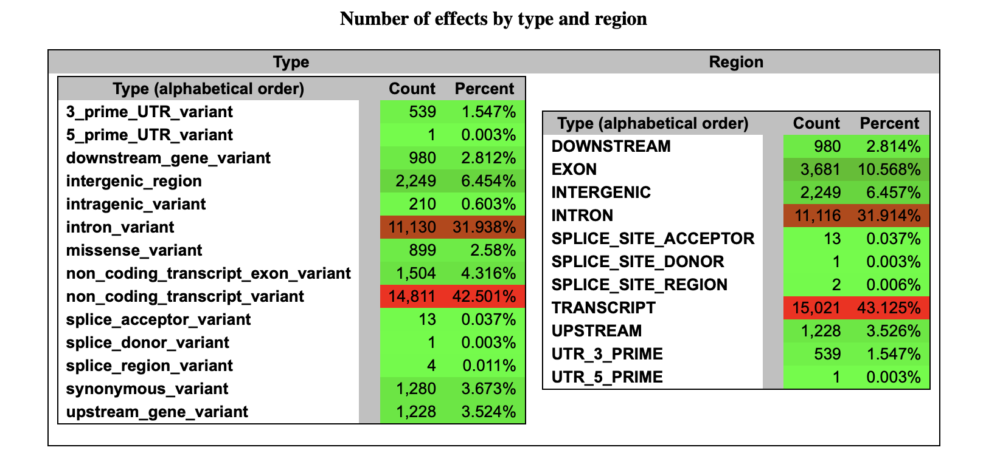
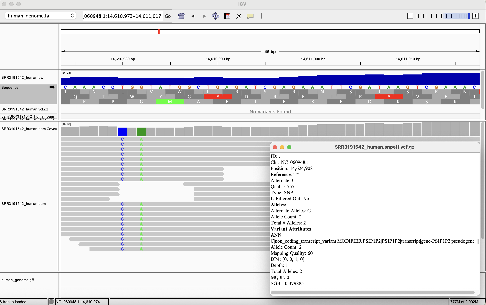
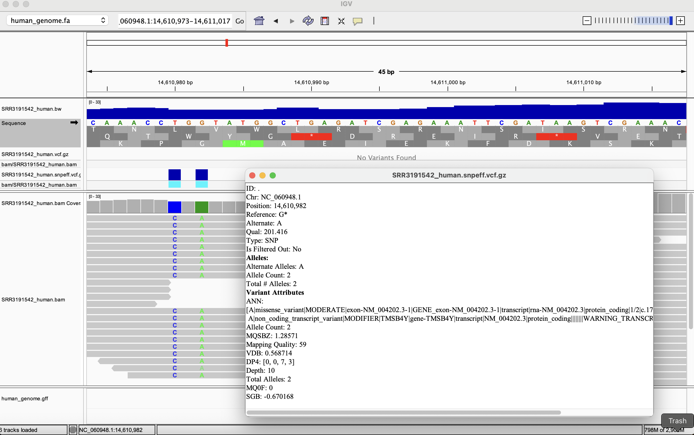
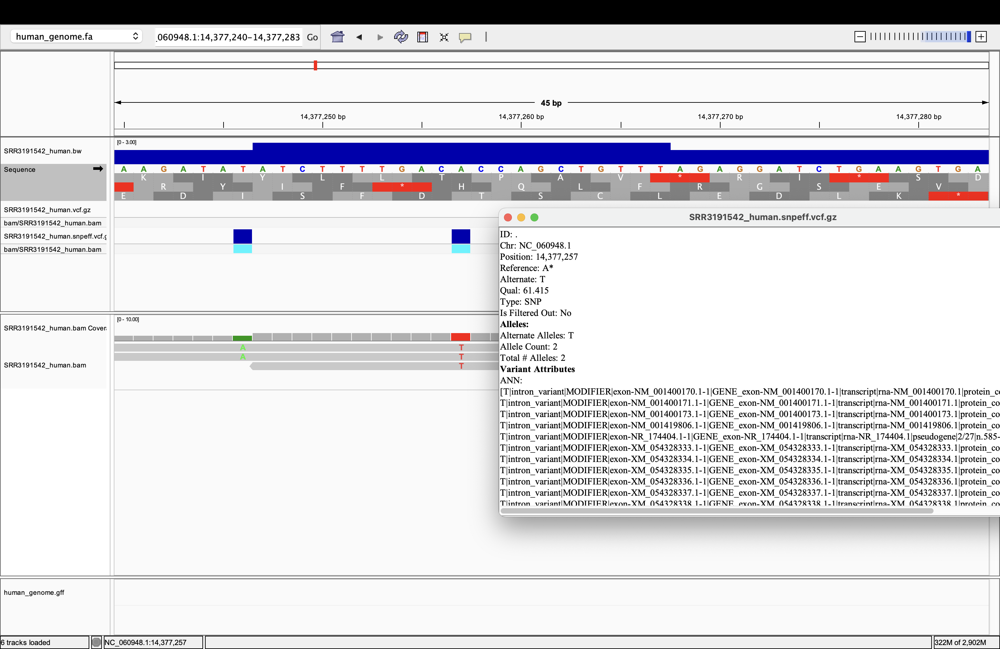

## Week 11 assignment
run snpEFF to provide variant effect annotations.

### workflow:
Make a design file from the BioProject accession.
Download and index the reference (FASTA + GFF).
get vcf files for each SRR: download FASTQ → align → make bigwig → call variants.
snpeff_build to build a custom snpEff database from that reference.
snpeff_run (or parallelized version) → annotate each VCF with snpEff.

### 1. Prepare design file 
```bash
make design PRJNA=PRJNA313294
```
### 2. Download and index the reference genome 
Download and index the reference genome (only needed once per species):
```bash
# human (Chr22 in this example)
make get_genome SPECIES=human ACC_human=NC_060948.1 GCF_human=GCF_009914755.1

# zika
make get_genome SPECIES=zika  ACC_zika=NC_012532.1  GCF_zika=GCF_000882815.3

```
```bash
# Build genome index
make genome_index SPECIES=human REF_FA=ref/human_genome.fa
make genome_index SPECIES=zika  REF_FA=ref/zika_genome.fa
```


## For processing single sample (single or paired-end), run:

```bash
# Download a subset of reads (first 100,000 for test)
make readsvcf SRR=SRR3191545 SPECIES=human N=100000

## Parallel processing of multiple samples 
To process all samples in parallel from design.csv, make sure GNU Parallel can create temporary files. On macOS the default temp dir sometimes isn't writable from conda environments — create a per-user tmpdir and pass it with `--tmpdir`.

Generate the design file
```
make design PRJNA=PRJNA313294
```
 
```bash
# Create a safe tmpdir (do this once per session)
mkdir -p ~/parallel_tmp
chmod 700 ~/parallel_tmp

#Process every SRR in design.csv with the one-stop target readsvcf
cat design.csv | \
  parallel --colsep , --header : --eta --lb --jobs 2 --tmpdir ~/parallel_tmp \
    make readsvcf \
      SRR={Run} \
      SPECIES=human \
      N=100000

# Merge all individual VCFs into one multi-sample VCF
bcftools merge vcf/*.vcf.gz -O z -o vcf/multisample_merged.vcf.gz
bcftools index -t vcf/multisample_merged.vcf.gz

#Build the custom database (after get_genome):
make snpeff_build SPECIES=human

# run snpeff on those srr files 
cat design.csv | \
  parallel --colsep , --header : --eta --lb -j 2 \
    make snpeff_run SPECIES=human SRR={Run}
```

## SNPEFF results 



## Variants observed and analyzed 

the reference fasta file, bam files (SRR3191542),SRR3191542.vcf.snpeff.vcf.gz file were loaded to IGV for visualization 

variant 1: At NC_060948.1:14,624,908 
we see a T→C SNP supported by a single, well-mapped read (MQ 60) but with low variant quality (QUAL ~5.8). snpEff annotates it as a non-coding transcript / pseudogene MODIFIER, so there’s no predicted functional impact. Because depth=1, this variant should be treated as low confidence and would normally be filtered out.



variant 2: At NC_060948.1:14,610,982
 we detected a G→A SNP with strong support (DP=10, QUAL≈201, alt on both strands). snpEff annotates it as a missense_variant (MODERATE) in the TMSB4Y transcript (NM_004202.3), indicating an amino-acid change in a protein-coding exon. This is a high-confidence, potentially functional variant, unlike the low-depth intergenic/intronic calls elsewhere. It is non-synonymous.



variant 3: NC_060948.1:14,377,264 

observed a G→C SNP with high variant quality (QUAL ≈ 61) but very low read depth (~2 reads). snpEff annotates it as an intron_variant/MODIFIER in multiple overlapping transcripts, so there is no predicted coding consequence. Because of the shallow coverage, this variant would typically be filtered out by standard depth filters even though the QUAL is high.

