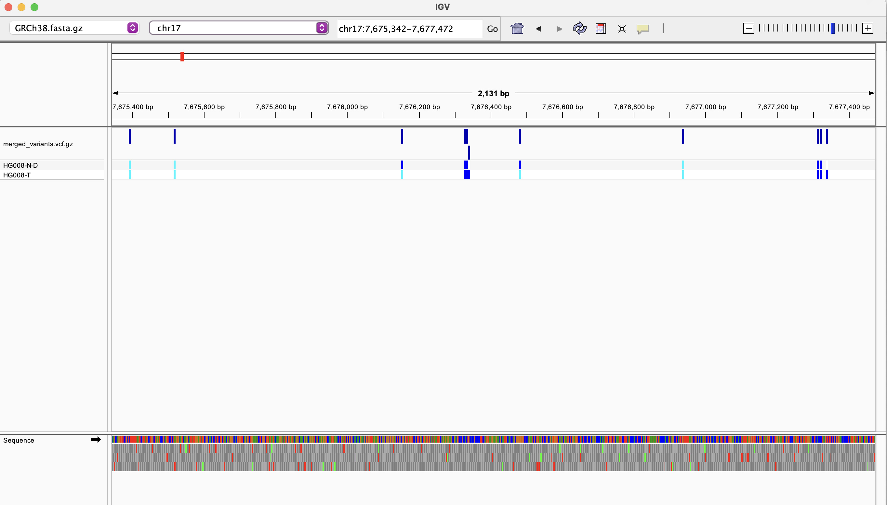
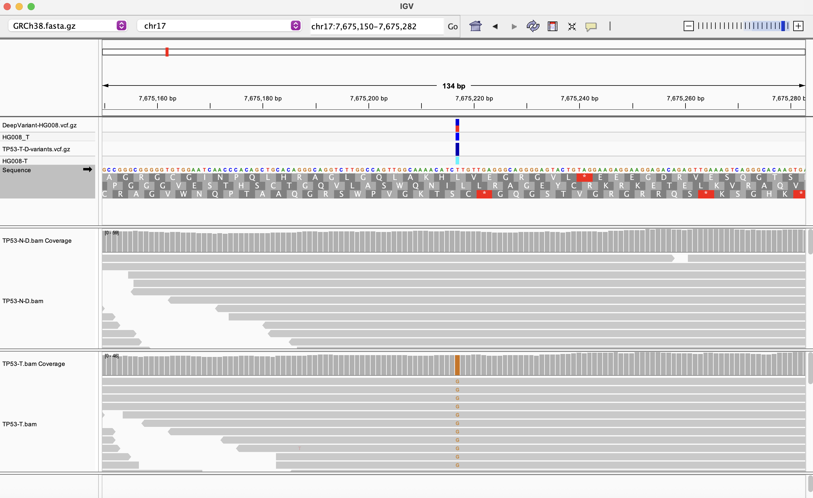

## Assignment for Week 12 : 
Working with data from the Cancer Genome in a Bottle project and produce an evaluation.
Paper can be found here - https://www.nature.com/articles/s41597-025-05438-2
Link for all data - https://ftp-trace.ncbi.nlm.nih.gov/ReferenceSamples/giab/data_somatic/HG008/Liss_lab/Element-AVITI-20241216/ 

I did the option2 homework- 
Tasks:
Call variants for normal and tumor samples in a region of interest
Compare variant calls between samples and identify tumor-specific variants
Compare your results to the gold standard DeepVariant calls (if available)

### First: Finding a region of interest
Gene I selected from the paper: TP53
 The remaining copy of this tumor suppressor gene contains a missense variant, K132T [c.395 A > C; p.Lys132Thr]. This variant is considered likely pathogenic in ClinVar. The overall genomic instability of the cell line, including large-scale deletions followed by whole genome doubling in some cells, is consistent with the known progression of tumors deficient in TP53

### Second: Look for evidence for tumor-specific mutations for this gene in the BAM file

Some details about the gene:
Reference: Genecard (https://www.genecards.org/cgi-bin/carddisp.pl?gene=TP53&keywords=TP53#localization)
Gene coordinates: chr17:7,565,097-7,590,856
Size: 25,760 bases

### Third: Get reference genome 

```bash
#declaring variables
REF_URL=https://ftp-trace.ncbi.nlm.nih.gov/ReferenceSamples/giab/release/references/GRCh38/GRCh38_GIABv3_no_alt_analysis_set_maskedGRC_decoys_MAP2K3_KMT2C_KCNJ18.fasta.gz

#Download the reference genome
REF=refs/GRCh38.fasta.gz

#The chromosome of interest.
CHR=chr17

make getref
```
### Fourth: Aligning with region of interest for normal and tumor tissue files

```bash 
#declare variables
BAM_URL=https://ftp-trace.ncbi.nlm.nih.gov/ReferenceSamples/giab/data_somatic/HG008/Liss_lab/Element-AVITI-20241216/HG008-N-D_Element-StdInsert_77x_GRCh38-GIABv3.bam
TUMOR_BAM_URL=https://ftp-trace.ncbi.nlm.nih.gov/ReferenceSamples/giab/data_somatic/HG008/Liss_lab/Element-AVITI-20241216/HG008-T_Element-StdInsert_111x_GRCh38-GIABv3.bam
CHR=chr17
REGION=chr17:7670000-7680000
BAM=bam/TP53-N-D.bam
TUMOR_BAM=bam/TP53-T.bam

make alignments
```
Output:
samtools flagstat ${BAM}
5097 + 0 in total (QC-passed reads + QC-failed reads)
5087 + 0 primary
0 + 0 secondary
10 + 0 supplementary
0 + 0 duplicates
0 + 0 primary duplicates
5086 + 0 mapped (99.78% : N/A)
5076 + 0 primary mapped (99.78% : N/A)
5087 + 0 paired in sequencing
2551 + 0 read1
2536 + 0 read2
5023 + 0 properly paired (98.74% : N/A)
5065 + 0 with itself and mate mapped
11 + 0 singletons (0.22% : N/A)
36 + 0 with mate mapped to a different chr
36 + 0 with mate mapped to a different chr (mapQ>=5)


samtools flagstat ${TUMOR_BAM}
3560 + 0 in total (QC-passed reads + QC-failed reads)
3553 + 0 primary
0 + 0 secondary
7 + 0 supplementary
0 + 0 duplicates
0 + 0 primary duplicates
3557 + 0 mapped (99.92% : N/A)
3550 + 0 primary mapped (99.92% : N/A)
3553 + 0 paired in sequencing
1777 + 0 read1
1776 + 0 read2
3515 + 0 properly paired (98.93% : N/A)
3547 + 0 with itself and mate mapped
3 + 0 singletons (0.08% : N/A)
29 + 0 with mate mapped to a different chr
29 + 0 with mate mapped to a different chr (mapQ>=5)

###  Task 1: Call variants from the normal and tumor tissue files
```bash
make variants
```
Outputs:
```bash
#The number of variants found in normal tissue
 bcftools view vcf/TP53-N-D-variants.vcf.gz | grep -v '^#' | wc -l
      18
#The number of variants found in tumor tissue
bcftools view vcf/TP53-T-D-variants.vcf.gz | grep -v '^#' | wc -l
      15
```
This will also generate merged vcf files for visualization in IGV: 


### Task 2: Compare variant calls between samples & identify tumor-specific variants
```bash
#declare variable
INTERSECT=vcf/intersected_variants/
make bcftools_intersect
```
Output:
```bash
#The number of variants only in normal sample 
grep -v '^#' vcf/intersected_variants/0000.vcf | wc -l
6
#The number of variants only in tumor sample
grep -v '^#' vcf/intersected_variants/0001.vcf | wc -l
3
#The number of variants common in both normal and tumor samples
grep -v '^#' vcf/intersected_variants/0002.vcf | wc -l
12
grep -v '^#' vcf/intersected_variants/0003.vcf | wc -l
 12
```
Summary:
I called variants independently in a TP53 window on chr17 using the HG008 normal (TP53-N-D) and tumor (TP53-T-D) BAMs. In this region, the normal sample harbored 18 variant sites and the tumor sample 15. Using bcftools isec, I decomposed these into 6 variants seen only in the normal sample, 3 variants seen only in the tumor sample, and 12 variants shared between normal and tumor. The three tumor-only variants represent candidate somatic TP53-region mutations in this cell line, whereas the shared variants are likely germline, present in both normal and tumor.

### Task 3: Compare to gold standard DeepVariant calls
```bash
#declare variables
VCF_GS=https://ftp-trace.ncbi.nlm.nih.gov/ReferenceSamples/giab/data_somatic/HG008/Liss_lab/analysis/Ultima_DeepVariant-somatic-SNV-INDEL_20240822/HG008_edv_AF_recalibration.result.PASS.vcf.gz
make compare_to_gs 
```
Output:
```bash
#The number of variants only in gold standard
$ grep -v '^#' vcf/gs_comparison/0000.vcf | wc -l
   13029
$ #The number of variants only in tumor sample
$ grep -v '^#' vcf/gs_comparison/0001.vcf | wc -l
      14
#The number of variants common in both gold standard and tumor samples
$ grep -v '^#' vcf/gs_comparison/0002.vcf | wc -l
       1
#looking at the single variant in detail
$ grep -v '^#' vcf/gs_comparison/0002.vcf
chr17  7675217  .  T  G  ...  AF=0.5;CSQ=...TP53...c.395A>C|p.K132T...
#That’s exactly the paper’s TP53 K132T (c.395A>C; p.Lys132Thr) – the key TP53 driver mutation.
```
Summary: 
To evaluate our variant calls, we compared the TP53-region tumor VCF (bcftools mpileup + bcftools call) to the DeepVariant somatic gold-standard VCF provided with the HG008 dataset. Using bcftools isec, we found 13029 variants that were present only in the DeepVariant calls, 14 variants that were present only in our bcftools tumor VCF, and only 1 variant that was shared between the two callsets. Thus, our simple bcftools-based pipeline recapitulates only a tiny fraction of the TP53-region variants reported by DeepVariant and also introduces a small number of additional calls that are not supported by the gold standard.

### Visualizing the variant

In the TP53 window, we identified a single high-confidence variant that was shared between our bcftools tumor calls and the DeepVariant somatic gold-standard (“gs_comparison/0002.vcf”). This variant is located at chr17:7675217 (GRCh38) and corresponds to a T>G substitution with an estimated allele frequency of ~0.5 in the tumor sample. Annotation with VEP (CSQ field) indicates that this change is a missense variant in TP53, c.395A>C, p.Lys132Thr (K132T), with multiple database entries (rs1057519996 and COSMIC IDs). This is precisely the K132T TP53 variant described in the original paper as a likely pathogenic alteration in ClinVar. Thus, our simple bcftools-based workflow successfully recapitulates the key TP53 driver mutation in HG008, even though it shows poor agreement with DeepVariant for the majority of lower-confidence variants in the region.



Figure: IGV visualization of the TP53 K132T somatic variant in HG008.
IGV view of chr17:7,675,150–7,675,282 (GRCh38) showing the TP53 coding sequence and aligned reads from the HG008 normal (TP53-N-D.bam) and tumor (TP53-T.bam) samples, along with variant tracks from the DeepVariant gold-standard VCF and our bcftools tumor VCF. At position chr17:7,675,217, the DeepVariant and bcftools VCF tracks both show a T→G SNV (vertical variant marker). In the tumor BAM, approximately half of the reads carry the alternate G allele at this position, consistent with a heterozygous mutation, whereas the normal BAM shows only the reference T allele at the same site. Annotation identifies this change as TP53 c.395A>C, p.Lys132Thr (K132T), a likely pathogenic missense variant described in the original Cancer Genome in a Bottle study.