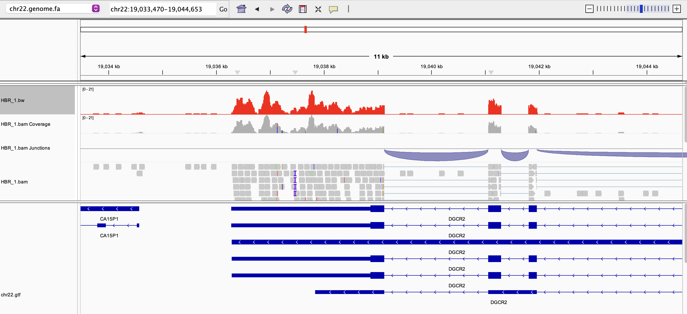
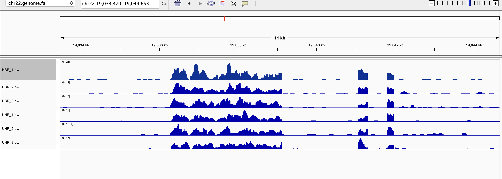
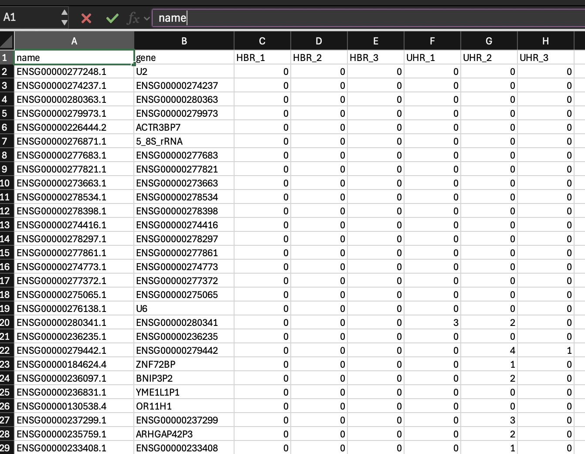
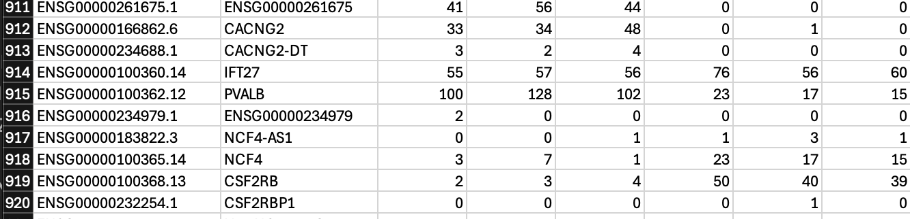
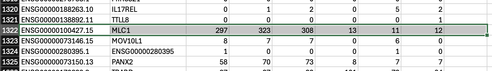
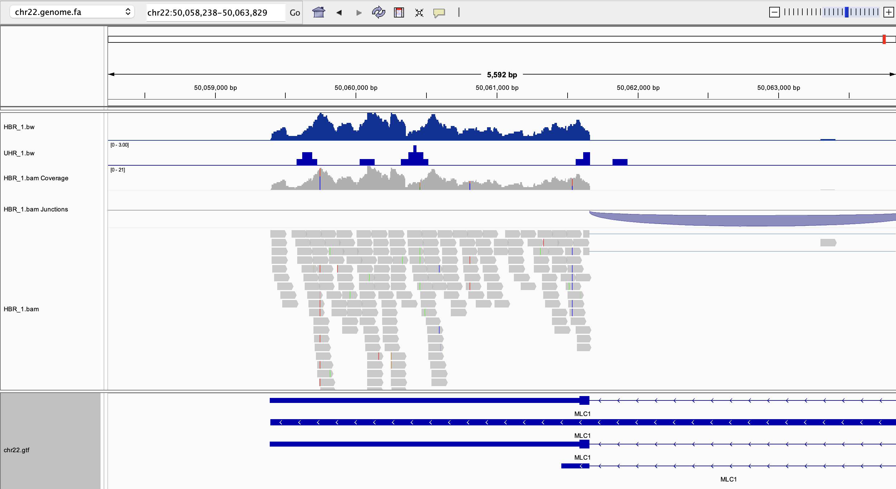

## Week 13 Assignment 
### Generating a genome based RNA Seq Count Matrix 

To do: 
1. Download the data
2. Get the refernce and investigate
3. Investigate the FASTQ files
4. Creating design file 
5. Generating index file
6. Generate a single alignment 
7. Visualize the alignment, coverage 
8. Count reads over features

Prerequisites:
```
bio code 
```
creating and activating stats env - 
```
mamba activate stats
```

### Downloading the data (reference and fastq files)
```bash
make getref
```
Now we have:
ref
-chromosome 22 genome file
-chromosome 22 gtf file 

reads
-6 samples (3 untreated, 3 treated)

```bash
make stats
```
stats of ref file
```
processed files:  2 / 2 [======================================] ETA: 0s. done
file                       format  type  num_seqs     sum_len     min_len     avg_len     max_len
refs/chr22.genome.fa       FASTA   DNA          1  50,818,468  50,818,468  50,818,468  50,818,468
refs/chr22.transcripts.fa  FASTA   DNA      4,506   7,079,970          33     1,571.2      84,332
```

Stats of fastq file
```
file               format  type  num_seqs     sum_len  min_len  avg_len  max_len
reads/HBR_1_R1.fq  FASTQ   DNA    118,571  11,857,100      100      100      100
reads/HBR_2_R1.fq  FASTQ   DNA    144,826  14,482,600      100      100      100
reads/HBR_3_R1.fq  FASTQ   DNA    129,786  12,978,600      100      100      100
reads/UHR_1_R1.fq  FASTQ   DNA    227,392  22,739,200      100      100      100
reads/UHR_2_R1.fq  FASTQ   DNA    162,373  16,237,300      100      100      100
reads/UHR_3_R1.fq  FASTQ   DNA    185,442  18,544,200      100      100      100
```

### Creating design file 
```
make design
```
Output
```
sample,group
HBR_1,HBR
HBR_2,HBR
HBR_3,HBR
UHR_1,UHR
UHR_2,UHR
UHR_3,UHR
```
### Aligning the reads to the genome and create BAM and BigWig files
short read aligner - HiSat2 is used 
first, indexing the reference genome 
```
make index
```

Generate a single alignment 
```
make -f src/run/hisat2.mk \
        REF=refs/chr22.genome.fa \
        R1=reads/HBR_1_R1.fq \
        BAM=bam/HBR_1.bam \
        run

```
Generate for all alignments 
```
make alignall
```

### Visualizing the alignments

The data looks good, the splice aligner HiSat2 did the job and we can see splice junctions. There is good exon coverage for this genes, some exons have low coverage possibly due to isoform specific or low expression isoforms


The BigWig coverage tracks for all six RNA-seq samples is shown. The three replicates of each sample looks almost the same, the height differ a little, that is normal. the major exon peaks align perfectly across all three replicates.


### Count matrix 
features count program to count reads with overlapping features
for single sample 
```
featureCounts -a refs/chr22.gtf -o counts.txt bam/HBR_1.bam
```
for all samples 
```
make counts
```

output
```
# Program:featureCounts v2.1.1; Command:"featureCounts" "-a" "refs/chr22.gtf" "-o" "counts.txt" "bam/HBR_1.bam" "bam/HBR_2.bam" "bam/HBR_3.bam" "bam/UHR_1.bam" "bam/UHR_2.bam" "bam/UHR_3.bam" 
Geneid  Chr     Start   End     Strand  Length  bam/HBR_1.bam   bam/HBR_2.bam   bam/HBR_3.bambam/UHR_1.bam    bam/UHR_2.bam   bam/UHR_3.bam
ENSG00000277248.1       chr22   10736171        10736283        -       113     0       0    00       0       0
```

### counting strand speicificity
```
make strandcounts
```

### Reformatting the counts with stats env

```
mamba activate stats
make formatcounts
```

### Gene mapping from transcripts
to make thr gene IDs in counts.csv easily recognizable, we will associate Ensembl gene names with it
First - obtain mapping between transcripts and gene names 
a txt2gene.csv file is generated which connects the various identifiers
next create transcript to gene id mapping file 
```
make tx2gene
```
adding the gene names to the csv file
```
make counts_csv
```

The counts.csv file looks like this with gene names mentioned. 

### Comments on count matrix 
lines which show consistent gene expression levels 
A screenshot of count matrix file where the IFT27 gene show consistent gene expression level



To verify the accuracy of my count matrix, I compared the read counts for the gene MLC1 between HBR and UHR samples. In the count matrix, HBR samples show ~300 reads, whereas UHR samples have only ~10–13 reads. When viewing the same region in IGV, the HBR tracks display strong and continuous coverage across all exons with dense aligned reads, consistent with high expression. In contrast, UHR tracks show almost no coverage, matching the very low read counts in the matrix. The splice junctions in HBR samples are also clearly visible, further confirming high transcript abundance. This demonstrates that the count matrix is fully consistent with the visual evidence from the alignment tracks.


For the gene, MLC1- HBR_1 count is 297 and UHR_1 is 13
•MLC1 is highly expressed in HBR
•MLC1 is barely expressed in UHR

Verify that in IGV

for HBR_1.bw track 
It is very tall meaning high mRNA abundance, dense peaks can be seen across the entire gene body, continuous coverage across all exons. This supports 297–323 reads in HBR replicates.

 for UHR_1.bw track
 Almost completely flat, only tiny peaks at a few exons. This matches 11–13 reads in UHR replicates.

